<h2> An introduction to Cinder </h2>
<h3> ITP Unconference 2016 </h3>

Useful links:

Download Cinder: https://libcinder.org/download 

Cinder Forum: https://forum.libcinder.org/#AllForums 

Cinder Reference: https://libcinder.org/docs/release/v0.9.0/reference/index.html 

Learn OpenGL: http://learnopengl.com/ 

Robert Hodgin's work: https://vimeo.com/flight404 

---

<h4>Setting up Cinder</h4>
<h5>1) Download Cinder:</h5>

 Go to the Cinder website and download the latest release - 0.9.0 for Mac OSX (https://libcinder.org/download) 

<h5>2)	Move Cinder to your Documents folder </h5>

Move the extracted folder to your Documents folder. It’s a good Idea to keep the Cinder folder at this level (eg. /Users/Craig/Documents/cinder_0.9.0).  You can rename the folder, but I suggest keeping the release number, ie “0.9.0”, projects don’t necessarily work across separate builds.  In other words, a project that you built with cinder 0.8.4 may not necessarily run using 0.9.0 as as part of the library may have been deprecated.

<h5>3) Test that everything works </h5>

Navigate to the examples (called ‘samples’ in Cinder) and open the Xcode project file.  I like this one: '/Users/Craig/Documents/cinder_0.9.0/samples/_opengl/ParticleSphereGPU' 

Now, navigate to the 'xcode' folder and open the 'ParticleSphereGPU.xcodeproj' file.

Build and run the project by clicking the ‘play’ button, or using the keyboard shortcut ‘cmd+r’

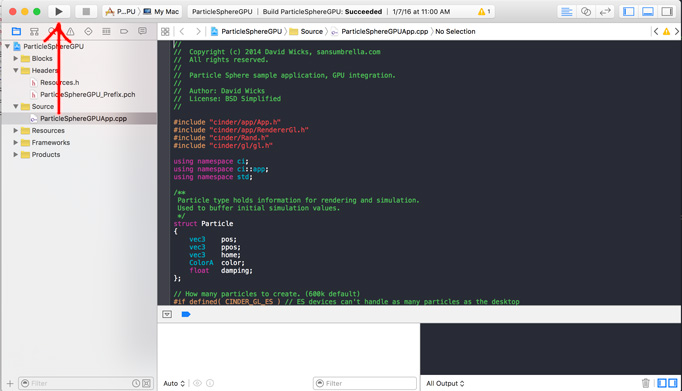

---

<h4>Section B:	Your first project</h4>

Create a folder inside the Cinder directory, give it a name, eg. “myProjects”.  the path to the folder should look something like this: ‘Users/Craig/Documents/Cinder_0.9.0/myProjects/’ 
NB: DO NOT MOVE THIS FOLDER AT ANY POINT ONCE YOU’VE CREATED IT.

Cinder provides us with a very convenient tool for creating new projects.  Use Tinderbox every time you want to create a new project.

Navigate to the folder Cinder > tools > TinderBox-Mac and open TinderBox - if you’ve just downloaded it you’ll need to right-click and select ‘open’

You should see something like this: 

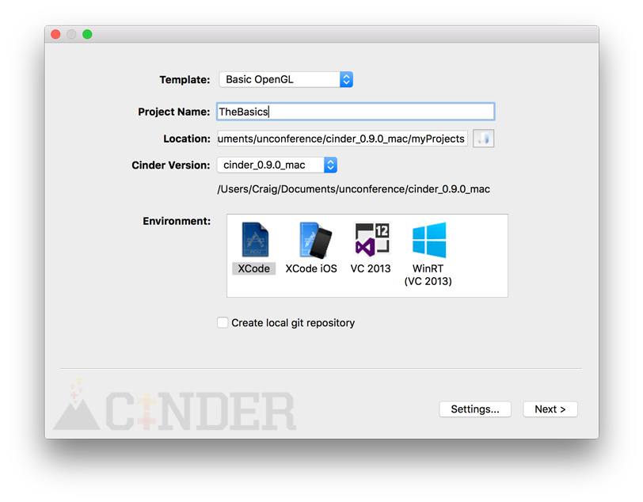

‘Template’ should always be ‘Basic OpenGL’.

Give your project a name, I recommend calling this first one “TheBasics”.

For ‘location’, select the folder you created earlier - this is where all your future projects will be stored.

The environment is ‘xCode’ and make sure ‘create local git repository’ is unchecked.

Click Next.  Click Finish.

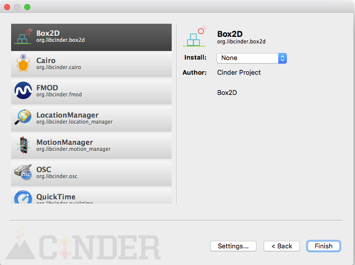

Navigate to the project folder and open your Xcode project file (‘your_project_name’.xcodeproj).

In Xcode, check that everything is working as it should by building and running the project (click the ‘play’ button, or cmd+r).

---

<h5>Section C:	What is Cinder? Why should we use it? and how does it work?</h5>

p5.js is an example of a library, or wrapper, for native javascript, designed to make creative coding more accessible to designers and artists etc.  In much the same way, Cinder, as well as openFrameworks, are creative coding frameworks based on the C++ language that are intended to make coding for creative purposes more accessible.  C++ is an incredibly powerful low-level language that puts a lot more of the decision making power into the hands of the programmer.  The power comes from the fact that you, as the programmer, are directly responsible for how your program uses your computer’s memory.  The advantage of this is that if you know what you’re doing,you can make things run incredibly efficiently.  The disadvantage of this however is that it’s significantly more complicated than higher level languages and, if you don’t manage the memory correctly, you can quite easily cause your application to crash.  Luckily, the folks who developed Cinder have created a comprehensive library of what are essentially convenience functions, that allow you to access the power of raw C++.  Furthermore, Cinder utilizes the power of OpenGL (Open Grapichs Library), which makes use of your computers GPU (Graphics Processing Unit) to achieve hardware-accelerated rendering.

C++ is a statically typed language.  A language is statically typed if the type of a variable is known at compile time. This in practice means that you as the programmer must specify what type each variable is (we’ll go through variable ‘types’ shortly).  Now, you might be asking yourself what exactly is “compile time”.  Well, when you build a c++ application, like a Cinder sketch, it goes through three stages before your application can be run: Preprocessing, Compilation, and Linking.

Preprocessing:
The preprocessor takes a C++ source code file and deals with the #includes, #defines and other preprocessor directives. The output of this step is a "pure" C++ file without pre-processor directives.  Any portion of the code that forms part of the preprocessor is marked with a hashtag ‘#’.  We’ll get to examples of these later.

Compilation:
The reason we use Xcode (or Microsoft Visual Studios for Windows) is because it comes with a compiler built-in.  The compiler takes the pre-processor's output and produces an object file from it.  Compilation refers to the processing of source code files (.c, .cc, or .cpp) and the creation of an 'object' file. This step doesn't create anything the user can actually run. Instead, the compiler merely produces the machine language instructions that correspond to the source code file that was compiled.  A simple way to think of this stage is to imagine that your compiler takes all the code from your separate .h and .cpp files (again, we’ll cover these soon), checks them for errors, and places them all in one file.  You can think of the p5.js, or p5.min.js files as the compiled versions of the p5 library for javascript.

Linking:
The linker takes the object files produced by the compiler and produces either a library or an executable file. Linking refers to the creation of a single executable file from multiple object files. In this step, it is common that the linker will complain about undefined functions (commonly, main itself). During compilation, if the compiler could not find the definition for a particular function, it would just assume that the function was defined in another file. If this isn't the case, there's no way the compiler would know -- it doesn't look at the contents of more than one file at a time. The linker, on the other hand, may look at multiple files and try to find references for the functions that weren't mentioned.

When you build and run your Cinder project, Xcode takes care of all three stages automatically.

---

<h5>Section D:	Hello World!</h5>

Open your newly created Xcode project  (eg. ‘TheBasics.xcodeproj’).

Xcode provides us with a debug console, similar to the one you’ll find in your web browser.  You can access the console by clicking the button shown in the screenshot below:

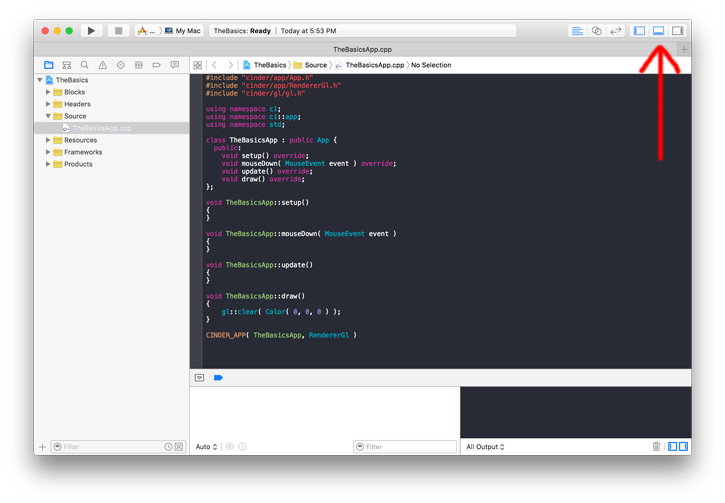

Unlike a web browser, where you’d print something using Serial.print(“blah blah”), C++ uses the Standard Output Stream, which is part of the C++ Standard Template Library.  We usually access library member functions using the ‘::’ operator.  For example, to make use of the standard output stream or “cout” (think of this as an abbreviation for “console out”).  So, in order to print something to the console, the code would look like this:
	std::cout << “Hello World!”;

Try placing this line of code in your project’s setup() function.  Build and run the project.  Your result should look like this:

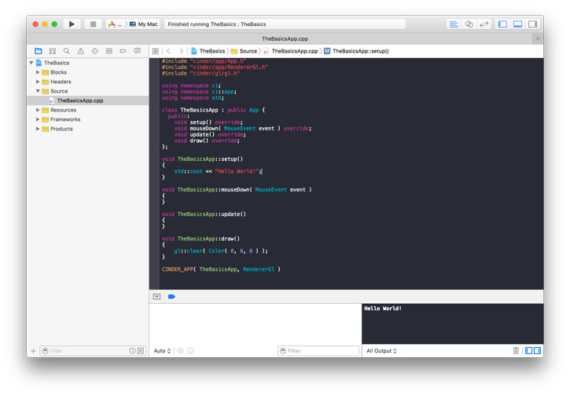

Having to write “std::” every time you want to print something to the console can be a bit tedious, along with using member functions from other libraries, so C++ allows us to use namespaces.  

You should see several lines of code in your project file that look like the image above.  “using namespace” is basically bringing everything from that library into your project’s scope.  Essentially, including “using namespace std;” in your code is like telling the compiler “consider everything in the std (standard ) library to be part of my project”.  By doing this, we can simply use: ‘cout << “Hello World!”; instead of “std::cout << “Hello World!”;

This seems trivial right now, but will save us time and effort later.

One last thing about about printing to the console… Think of Arduino’s “print()” function, it’ll print everything to the same line of the console, whereas “println()” includes a newline and carriage return, ie. it prints whatever you pass as an argument at the beginning of a new line.  To do this in C++, we include “endl” after “cout”, to tell the console stream that we want to end the line.  So, printing:

	cout << “Hello World, ”;
	cout << “my name is Craig.”;

will print the following to the console: 
	Hello World, my name is Craig.

whereas:

	cout << “Hello World, “ << endl;
	cout << “my name is Craig.” << endl;
	

will print:
<pre>
	Hello World,
	my name is Craig.
</pre>

---

<h4>Section E:	Variables and types.</h4>

As we mentioned before, C++ is statically typed, which means we need to declare what type of variable we’re creating.  In a language like Javascript, you can declare a an integer variable by simply writing “var myInt;”, whereas in C++ we need to expressly tell the compiler that “hey, this variable is an integer”, so we’d have to say “int myInt”.

For now, we’ll be focusing on a few basic types.
<pre>
Integers	
-	These are whole numbers (either positive or negative).
-	We declare an integer using int
-	Eg	. int myInt = 4;
-	Eg. 	int myOtherInt = -2;
</pre>
<pre>
Floats		
-	Floating point numbers have decimal place (fractional numbers) and can be positive or negative
-	We declare a float using float
-	Eg.	float myFloat = -3.045;
-	Eg.	float myOtherFloat = -0.001;
</pre>
<pre>
Booleans	
-	Evaluates to ‘true’ or ‘false’
-	We declare boolean variables using bool
-	Eg. 	bool isThisWorking = false;
</pre>
<pre>
String		
-	A string is actually an array of characters
-	We declare strings using quotation marks “ ” 
-	Eg. 	“Hello, my name is Craig”
</pre>
<pre>
Void	
-	“void” allows us to create functions that don’t return anything
-	Eg.	void myApp::setup()
		{
			cout << “this function doesn’t return anything” << endl;
		}
</pre>
<pre>
Vectors		
-	A vector is type of C++ container, similar to an array
-	We declare a vector using vector<T>, where ‘T’ represents the Type
- 	Eg. a vector containing integer values will be declared like this:
-	vector<int> myIntegerContainer;
</pre>

---

<h4>Section F:	Memory</h4>

This is where things start to get a little more complicated, so we’ll try and keep it as simple as possible.  Let’s use a simple analogy: think of a variable as a type of container, like a physical box, that can only hold one type of object. So, declaring an integer variable “int myBox” is like saying “i have a box, and the only thing that will fit in this particular box is an integer, and the box can only hold one at a time”.  Now, what’s important to remember is that when you declare a variable, your computer allocates it a very specific location in its physical memory - think of this as placing your box in a very specific place in a room, say the north-west corner. Imagine now that this box is glued to the floor, so that it cannot move.  It doesn’t matter what integer you put in the box, or how many times you swap it for another, the box never moves.  The same concept applies to memory allocation.  When you declare an integer variable (or any other type for that matter), your computer assigns that variable an address - this is its physical location in memory.  You can change the value of the integer as many times as you want, but the address remains the same.  

We can access the address of any variable using the address operator ‘&’ in front of the variable name.

Let’s test this out… place the following lines of code into your program:

<pre>
//declare your global integer variable ( above your app class )
int myInteger; 

//place the following lines in the setup() function:
    myInteger = 10;
    cout << "the value of myInteger is: " << myInteger << endl;
    cout << "myInteger's location in memory: " << &myInteger << endl;
    
    cout << endl;
    
    myInteger = -4;
    cout << "the value of myInteger is: " << myInteger << endl;
    cout << "myInteger's location in memory: " << &myInteger << endl;
</pre>

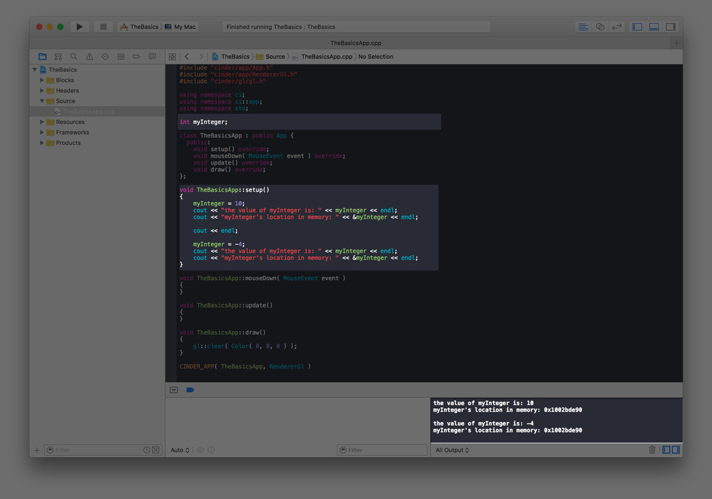

You can see from the console output that even though you’ve changed the value of the integer, the address, or the location in memory where the value of myInteger gets stored, never changes.  This is a small part of what makes C++ so powerful.  Ie. you’ve swapped the objects that were in the box, but the box still remains glued to the floor in the north-west corner of the room.

---
<h4>Section G:	Object-Oriented Programming (OOP)</h4>

Object-Oriented Programming (OOP) is far too complex of a topic to cover in a single three hour session, so we’ll do our best to give a brief conceptual overview, and explore the concepts as we go through the example code.

OOP is programming language model that focuses on the use of objects as the primary data structures.  Objects are modular pieces of reusable code.  At the heart of the OOP model are classes.  You can think of classes as a kind of template.  A class essentially describes what properties an object will have, but not the values of those properties.

A classic analogy of a class is using the example of a car.  Say you have a class called “Car”.  On a fundamental level, all cars are essentially the same: they have the same function, the have similar features, they work in much the same way, they all have wheels, the all have engines.  The class is like a blueprint for making the car.  You can think of an individual unique car being an Object. Let’s say that our Car Object is a VW beetle.  It’s part of the Car class, because it has doors, it has a chassis, it has a body, it has wheels, it has a specific paint colour, it serves to get people from A to B, it shares common traits with all other cars.  However, this specific VW object has a very unique shape, it has a particular type of engine, it has its own unique paint colour, it’s owned by a specific person.  The properties that differentiate the VW beetle from other cars belong to the object, but the blueprint for what makes it a car is down to the class.

---
<h4>Section H:	Particles!</h4>

Follow the steps outlined in Section B and create a new Cinder project using TinderBox.  Give it a name of your choosing, I’m calling mine ‘BasicParticles’ and ensure the location is set to the folder you created for your projects.

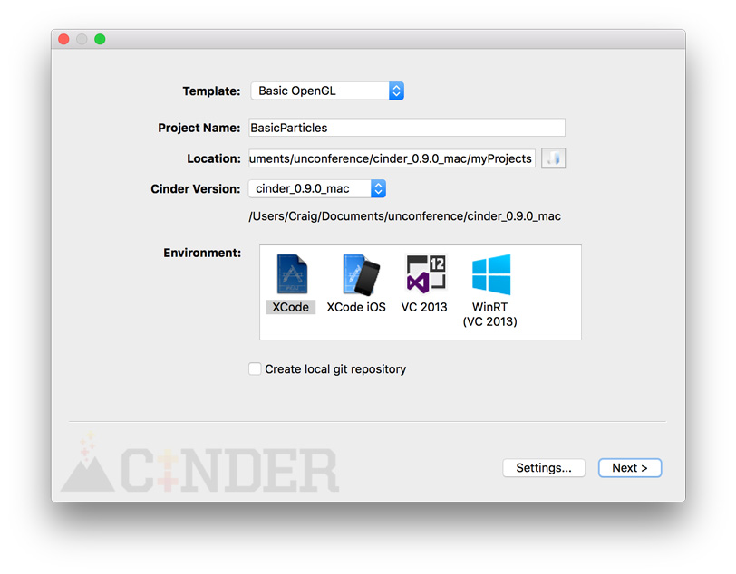
---
<h5>Step 1:	Creating a new Class</h5>

In the project navigator (by default on the left-hand side of xcode), right click on the “Source” folder and select “New File…”

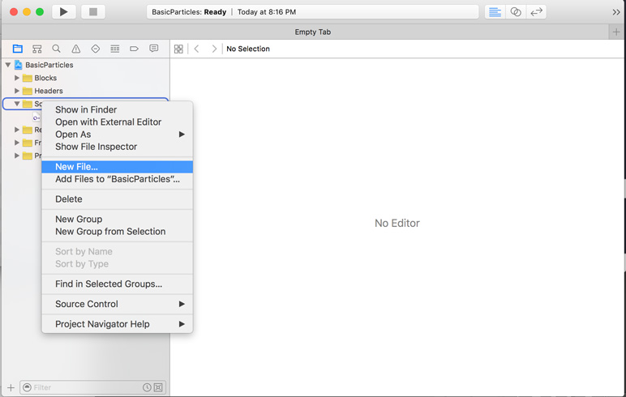

Select “C++ File”, click next.

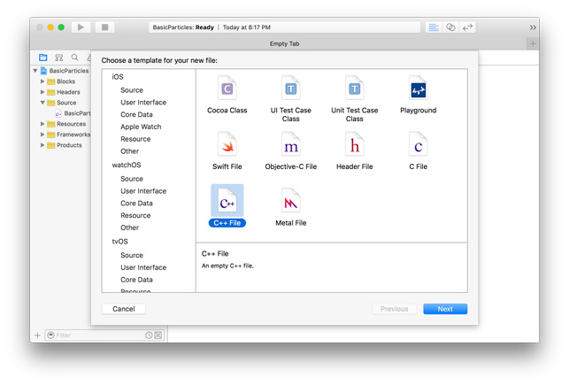

Type in “Particle”, make sure “also create a header file” is checked, click next.
Don’t do anything, and click “Create”.

You should see two new files “Particle.h” and “Particle.cpp” in your Source folder (if you have a newer version of xCode, the header might be a .hpp file, don’t panic this is fine, it won’t affect your program ).

Drag the ‘Particle.hpp’ file into the “Headers” folder.

A C++ class file is separated into two separate files: the header file ( .h or .hpp ) and the C plus plus file ( .cpp ).  The header file essentially declares what functions and variables the class will contain, whereas the .cpp file defines what they are.

---
<h5> Step 2:	Declaring the Particle Class in the header file</h5>

Click on the “Particle.h” (or “Particle.hpp”) file to open it.
Erase everything from the file, none of it is necessary.
*This may very depending on your version of Cinder and/or Xcode.

Add the following lines of code:

<pre>
	#pragma once

	#include <cinder/gl/gl.h>
	#include <cinder/Vector.h>
</pre>

if that gives you errors, try the following:

<pre>
	#pragma once

	#include “cinder/gl/gl.h”
	#include “cinder/Vector.h”
</pre>

Now add the following lines:

<pre>
	class Particle {
	};
</pre>

Build and run the program.

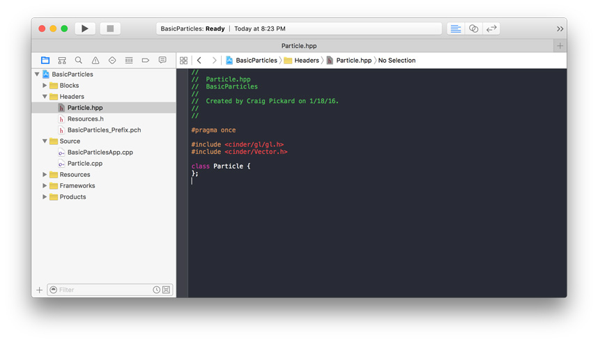

As we mentioned in Section C, lines of code that start with ‘#’ are preprocessor directives.  “#pragma once” tells the compiler to add this header file to the project only once, no matter how many other classes make use of it.  The #includes tell Xcode that you’ll be using pieces of code from the OpenGL and Vector libraries that form part of the C++ language.

We declare the type class by typing “class Particle { };”.  All of the code for our class will be placed between the curly braces.

Now we add the constructor, member functions and member variables.  Add the following lines of code inside your particle class:

<pre>
public:
    Particle();
    Particle( ci::vec2 location );
    
    void run();
    void update();
    void display();
    
    ci::vec2 mLocation;
    ci::vec2 mAcceleration;
    ci::vec2 mVelocity;
</pre>

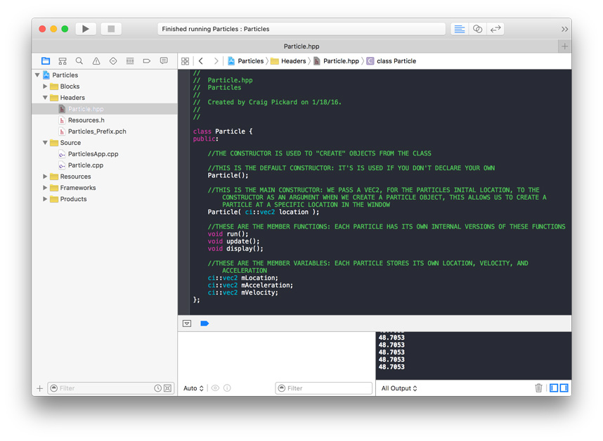

---

<h5>Step 3:	Defining the Class</h5>

Add the following lines of code to the Particle.cpp file:

<pre>
#include "cinder/Rand.h"

using namespace ci;
using namespace ci::app;

Particle::Particle()
{
}

Particle::Particle( ci::vec2 location )
{
    mAcceleration = ci::vec2( ci::randFloat(-.02,.02), ci::randFloat(-.02,.02));
    mVelocity = ci::vec2( ci::randFloat(-2,2) , ci::randFloat(-2,2) );
    mLocation = location;
}

void Particle::run()
{
    update();
    display();
}

void Particle::update()
{
    mVelocity += mAcceleration;
    mLocation += mVelocity;
    mAcceleration *= 0;
    if (mLocation.x > getWindowWidth() || mLocation.x < 0) mVelocity.x *= -1;
    if (mLocation.y > getWindowHeight() || mLocation.y < 0) mVelocity.y *= -1;
}

void Particle::display()
{
    gl::color( ColorA8u( 255, 255, 255, 255 ) );
    gl::drawSolidEllipse( mLocation, 3.0, 3.0 );
    
}
</pre>

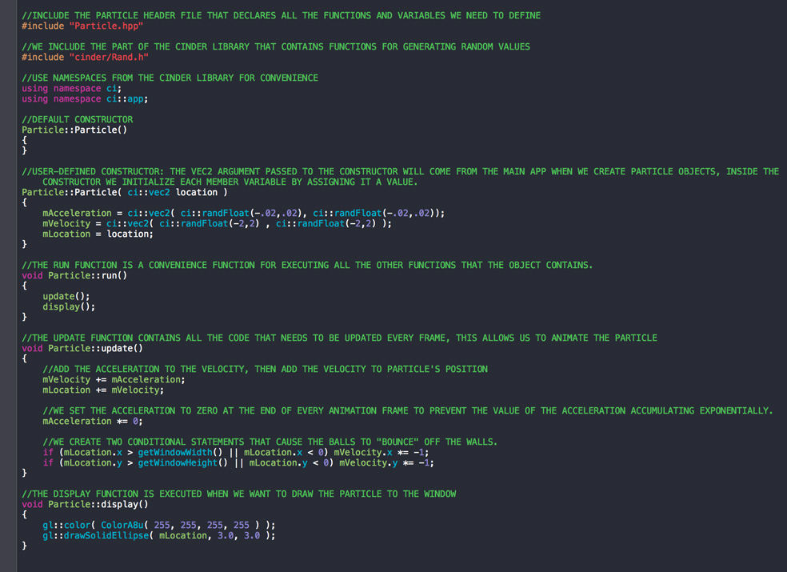

<h5>Step 4:	The main app</h5>

Open your main BasicParticlesApp.cpp file.

Add the following lines of code after the existing #includes:

<pre>
#include "Particle.hpp"
#include "cinder/Rand.h"
const int NUM_PARTICLES = 200;
</pre>

Add the following line of code inside the BasicParticlesApp class:

<pre>
	vector<Particle> mParticles;
</pre>

Add the following lines of code to your App’s setup() function:

<pre>
    mParticles = vector<Particle>();
    
    for (int i = 0; i < NUM_PARTICLES; i++)
    {
        vec2 rand = randVec2();
        rand.x *= getWindowWidth();
        rand.y *= getWindowHeight();
        mParticles.push_back( Particle( rand ));
    }
</pre>

Add the following lines of code to the App’s draw() function:

<pre>
    gl::clear( Color::black() );
    
    for (int i = 0; i < mParticles.size(); i++)
    {
        mParticles[i].run();
    }
</pre>

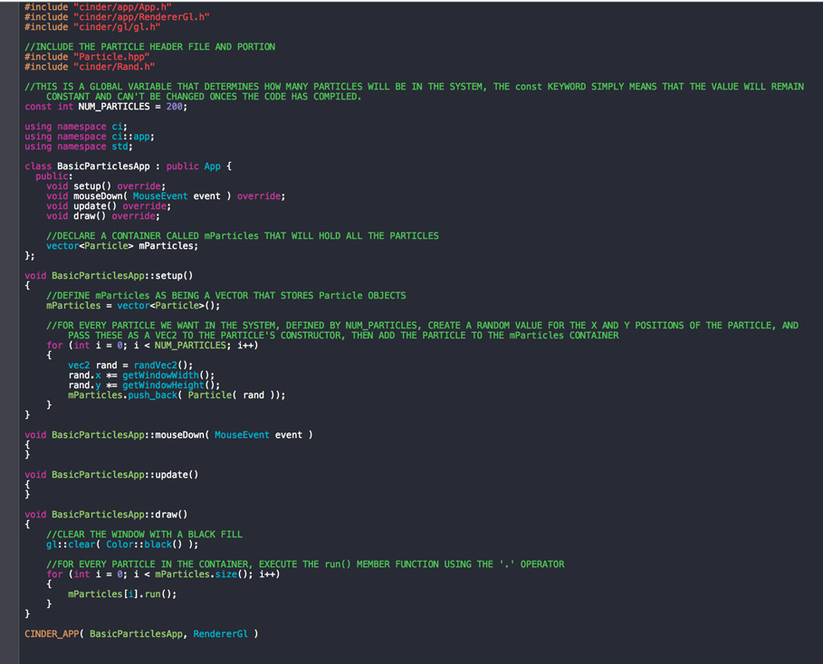

 Build and run the code.  Et Voila! 

---

<h3>What's next?  </h3>  

<h5>Adjusting the window Settings</h>

Unlike p5 or processing, adjusting the window size is not quite as straight forward, but is still easy enough once you know what to do.  Every C++ program needs a main() function.  The creators of Cinder have created the convenient functions for us in the form of setup(), update(), and draw() that automatically form part of the app's main() function by means of the CINDER_APP() that you find at the bottom of any Cinder project's main app .cpp file.  

  

From the picture above, you can see that the CINDER_APP() function takes 2 arguments.  The first is the code for your app (which is actually written as a class), and the second is you telling the main() C++ which renderer you want to use. In this case being the default *RendererGl*.

In order to adjust the window's settings, we need to pass a third argument to the CINDER_APP().  The third argument needs to be a function pointer.  Pointer's are a fundamental concept in C++ and are one of the reasons it's such a powerful language, however the concept can be difficult to grasp, especially at first.  We discussed earlier that a variable is actually a physical location in your computer's memory, or an *address*.  A *pointer* essentially points to that address.  Don't worry if that doesn't make much sense yet, it's not too important at this juncture.  Just know that when we pass a function pointer as an argument, it's simply like saying "There's a function that exists somewhere, and it's located in physical memory at address 'x'.  Go to that address and execute the code you find there.

We pass a function pointer using the following syntax:

<pre>
[&]( App::Settings *settings ) {
	settings->setWindowSize( 1280, 720 );
}
</pre>  

Your final CINDER_APP() should look something like this:

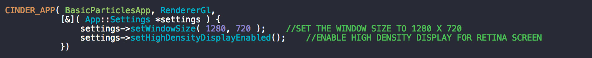
